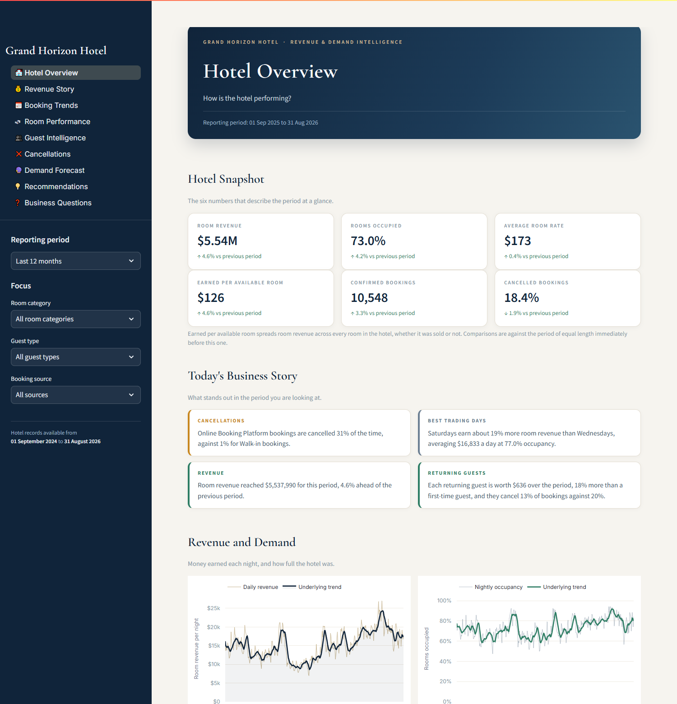
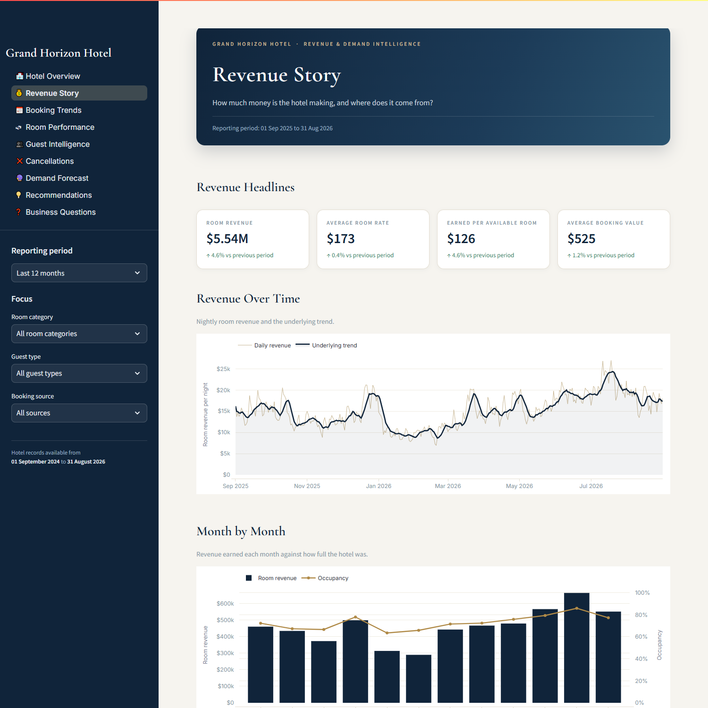
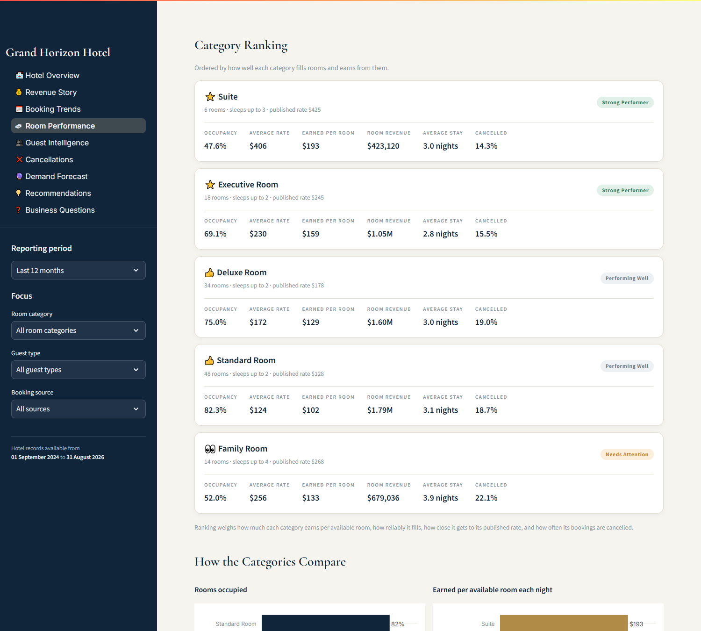
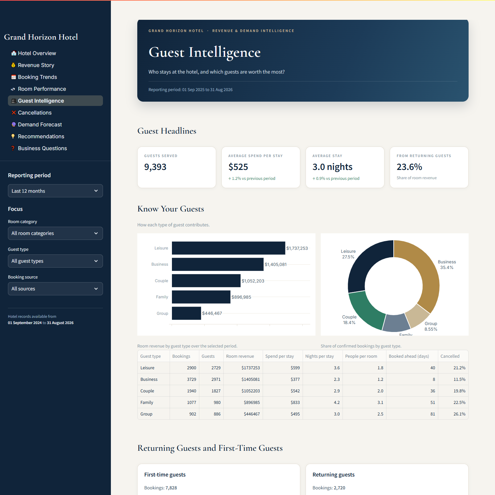
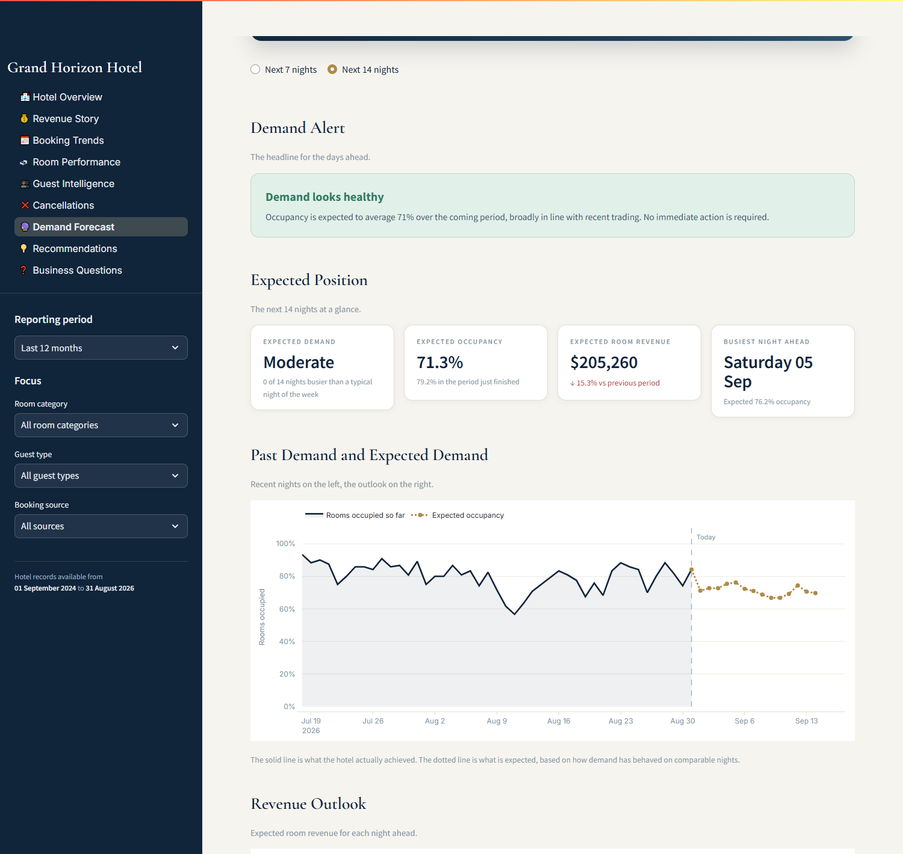
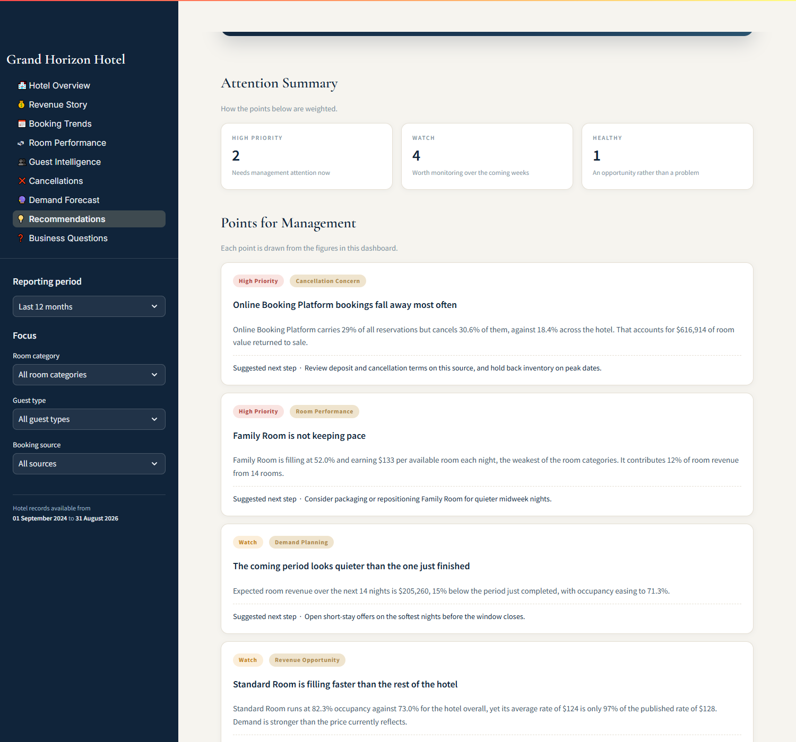
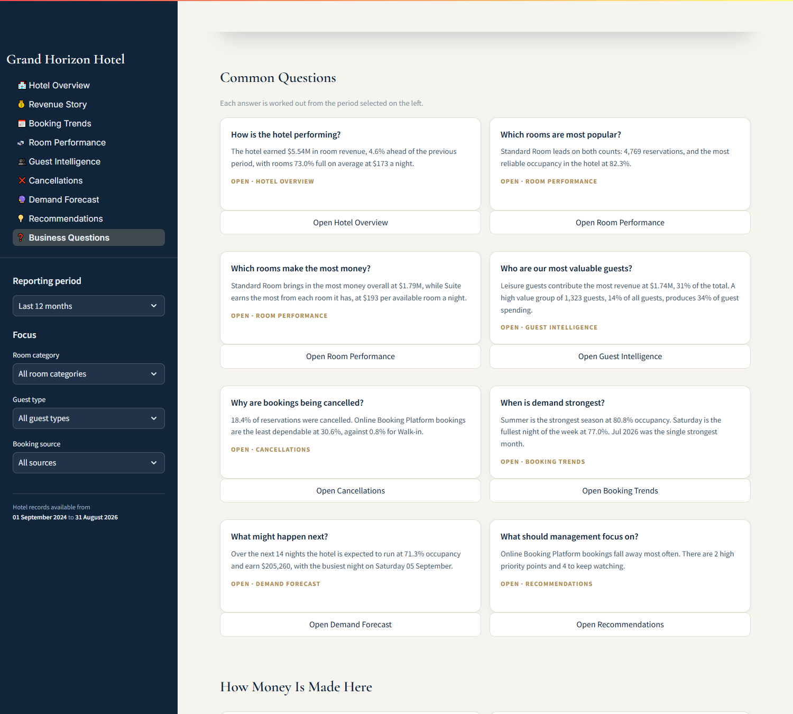

# Hotel Revenue & Demand Intelligence System

A decision-support dashboard for hotel management that turns two years of booking records into
plain-language answers about revenue, demand, guests, cancellations and the fortnight ahead.

Built around a fictional 120-room property, **Grand Horizon Hotel**, the system combines business
analytics, customer segmentation and machine-learning demand forecasting behind an interface
designed for a hotel owner or general manager rather than an analyst.



---

## The business problem

A hotel manager sitting in front of a property management system can see thousands of individual
reservations and almost none of the picture they need:

- Is revenue actually growing, or does it only look that way because it is summer?
- Which room categories earn their keep, and which quietly under-perform?
- Why do a fifth of reservations disappear before the guest arrives?
- Which guests are worth keeping, and which simply booked once and left?
- How full will the hotel be next week, and should rates or staffing change because of it?

Answering those questions normally means exporting spreadsheets and waiting for someone technical.
This system answers them continuously, in the language a manager already uses, and points to the
handful of decisions that matter this week.

---

## Key features

**Revenue analytics** — Room revenue, average daily rate, RevPAR and average booking value across
any period, split by room category, booking source and guest type, with the strongest and weakest
months identified automatically.

**Booking analytics** — Arrivals by day, week and month; how far ahead guests reserve; which days
of the week and which seasons carry demand; and a month-by-weekday view of when the hotel reliably
fills.

**Room performance** — Every category ranked on how much it earns per available room, how reliably
it fills, how close it gets to its published rate, and how often its bookings fall away, with a
plain standing of Strong Performer, Performing Well or Needs Attention.

**Guest intelligence** — Guest types compared on spend, stay length and cancellation behaviour;
returning guests measured against first-time guests; and a four-way segmentation into High Value,
Regular, Occasional and Low Engagement groups built from actual stay and spending behaviour.

**Cancellation analysis** — Cancellation rates by booking source, guest type, room category,
booking window, season and promotional status, together with the room value each pattern returns
to sale.

**Demand forecasting** — A learned model projects rooms sold and achieved rate for the next 7 to
14 nights, converted into expected occupancy, expected revenue, a demand level for each night, and
a single business-friendly alert.

**Management recommendations** — Four to seven prioritised points drawn from the figures above,
each stating the evidence and a suggested next step.

**Business questions** — Large question cards that answer common management questions directly and
link through to the page holding the detail.

---

## Dashboard pages

| Page | The question it answers |
| --- | --- |
| Hotel Overview | How is the hotel performing? |
| Revenue Story | How much money are we making, and where does it come from? |
| Booking Trends | What are guests booking, and when do they book it? |
| Room Performance | Which rooms fill the hotel, and which ones earn the most? |
| Guest Intelligence | Who stays here, and which guests are worth the most? |
| Cancellations | Why are bookings being cancelled, and what does it cost? |
| Demand Forecast | What may happen next? |
| Recommendations | What deserves management attention? |
| Business Questions | Ask a question, go straight to the answer |

Every page responds to the same four controls in the sidebar: reporting period, room category,
guest type and booking source.

---

## Screenshots

| Revenue Story | Room Performance |
| --- | --- |
|  |  |

| Guest Intelligence | Demand Forecast |
| --- | --- |
|  |  |

| Management Recommendations | Business Questions |
| --- | --- |
|  |  |

Booking Trends is shown in [`assets/screenshots/03-booking-trends.png`](assets/screenshots/03-booking-trends.png).

---

## Forecasting approach

Demand is forecast with a gradient-boosted regression model from scikit-learn, trained directly on
the hotel's own nightly history.

- **Direct multi-horizon forecasting.** Rather than feeding predictions back into themselves, the
  model learns a mapping from "what we know today" to "what happens *h* nights from now", with the
  horizon supplied as a feature. This avoids the error accumulation that recursive forecasting
  suffers over a two-week window.
- **Features.** Recent lags and rolling averages of rooms sold, short-term momentum, calendar
  position (day of week, month, cyclical day-of-year terms), promotional and special-period flags
  read forward from the hotel's own annual calendar, and the value recorded on the equivalent
  night a year earlier.
- **Two targets.** Rooms sold and achieved rate are modelled separately, so expected revenue,
  occupancy and RevPAR all follow from a single consistent pair of predictions.
- **Time-aware validation.** The most recent 28 nights are held out and never seen in training.
  Accuracy is measured on that window and compared against a seasonal-naive baseline that repeats
  the same weekday a week earlier. On the generated dataset the model predicts rooms sold to within
  roughly six rooms a night and beats the baseline.
- **Safeguards.** Predictions are clipped to the physically possible range, never negative and
  never above the rooms that exist. With fewer than 120 nights of history the system falls back to
  a weekday-pattern projection, and with no usable history it reports that no outlook is available
  rather than inventing one.

Nothing about the model surfaces in the dashboard. Managers see expected demand, expected
occupancy, expected revenue and a written explanation.

---

## Technology

| Layer | Tools |
| --- | --- |
| Interface | Streamlit |
| Charts | Plotly |
| Analysis | pandas, NumPy |
| Forecasting | scikit-learn |
| Storage | SQLite |
| Tests | pytest |

Everything runs locally on a modest machine. There is no GPU requirement, no container, no cloud
service, no external API and no credential of any kind. After installation the application works
entirely offline.

---

## Project structure

```
Hotel Revenue and Demand Intelligence/
├── app.py                     Application shell: theme, navigation, global filters
├── requirements.txt
├── conftest.py
│
├── data/
│   ├── make_dataset.py        Deterministic synthetic data generator
│   ├── README.md              What is simulated and how to rebuild it
│   └── hotel.db               Generated SQLite database (not committed)
│
├── src/
│   ├── data_loader.py         Cached database access and filtering
│   ├── context.py             Builds one filtered analysis context per view
│   ├── analytics.py           Hotel KPIs, room performance, cancellation breakdowns
│   ├── customer_analysis.py   Guest segmentation and guest-type profiling
│   ├── forecasting.py         Demand and rate forecasting, validation, alerts
│   ├── business_insights.py   Automated insight and recommendation engine
│   ├── charts.py              Plotly chart builders
│   ├── ui.py                  Design system: cards, sections, badges, theme
│   ├── page_support.py        Shared page helpers and caching
│   └── utils.py               Palette and formatting
│
├── pages/                     One module per dashboard page
│
├── tests/
│   ├── test_data.py           Dataset integrity and realism
│   ├── test_analytics.py      KPI bounds and internal consistency
│   └── test_forecasting.py    Forecast validity and fallback behaviour
│
└── assets/screenshots/
```

The analytics layer is deliberately free of Streamlit. Every calculation in `src/analytics.py`,
`src/customer_analysis.py`, `src/forecasting.py` and `src/business_insights.py` is an ordinary
function over DataFrames, which is why the test suite can exercise them directly.

---

## Installation

Requires Python 3.10 or newer.

```bash
git clone https://github.com/ZaghamAzeem/Dashboards.git
cd "Dashboards/Hotel Revenue and Demand Intelligence"
python -m venv .venv
```

Activate the environment — `\.venv\Scripts\activate` on Windows, `source .venv/bin/activate`
on macOS or Linux — then install the dependencies:

```bash
pip install -r requirements.txt
```

## Generating the data

```bash
python data/make_dataset.py
```

This builds `data/hotel.db` and prints a validation summary. The generator is seeded, so the same
dataset is produced on every machine and every run. See [`data/README.md`](data/README.md) for what
is simulated.

## Running the dashboard

```bash
streamlit run app.py
```

The dashboard opens at `http://localhost:8501`.

## Testing

```bash
pytest
```

The suite covers dataset integrity (tables, columns, date validity, no negative revenue, no
duplicate identifiers, occupancy within capacity, reconciliation between the booking and daily
tables), analytics correctness (KPIs within valid bounds and internally consistent, shares summing
to 100%, graceful handling of empty selections) and forecasting behaviour (horizon respected,
non-negative predictions, capacity respected, quality measured, fallback on short history,
reproducibility).

---

## Business value

The dashboard is organised as a single argument rather than a collection of charts. It moves from
*what happened* through *why it happened* to *what is likely next* and *what to do about it*, and
it supports concrete decisions:

- **Pricing** — spotting categories where demand outruns the rate being achieved
- **Inventory** — protecting availability on nights the outlook shows filling up
- **Channel strategy** — quantifying what third-party bookings cost in rate and in cancellations
- **Policy** — targeting deposit and cancellation terms at the sources and booking windows that
  actually fall away
- **Marketing** — directing loyalty effort at guests whose repeat value is measurable
- **Planning** — treating the predictable soft months as something to fill in advance

Every number, insight, ranking and recommendation is computed from the underlying records for the
period selected. Nothing is hard-coded, and where a figure cannot be calculated the interface says
so rather than inventing one.

---

## Limitations

- **The data is synthetic.** It is generated by `data/make_dataset.py` to be realistic in its
  structure and relationships, but it describes no real hotel and no real guest. Nothing here
  should be read as a claim about any actual property's performance.
- **Guests are anonymous by construction.** The generator produces only sequential identifiers such
  as `GUEST-00042`. No names, contact details or other personal information exist in the dataset.
- **The forecast horizon is short.** Fourteen nights is where the nightly patterns in this data
  carry useful signal. Longer projections would need the forward booking position, which a
  historical extract does not contain.
- **Costs are out of scope.** The system analyses room revenue. Operating costs, payroll, food and
  beverage and channel commission are not modelled, so it measures revenue performance rather than
  profit.
- **Single property.** The design assumes one hotel. Multi-property comparison would need a
  different data model.

This is a portfolio project built to demonstrate end-to-end capability across data generation,
analytics, machine learning and decision-support interface design.
